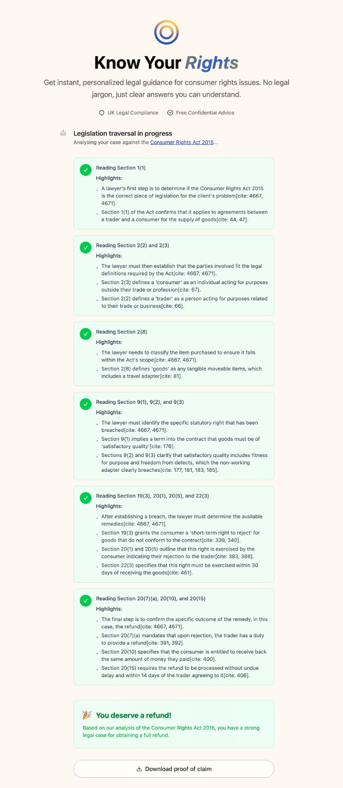
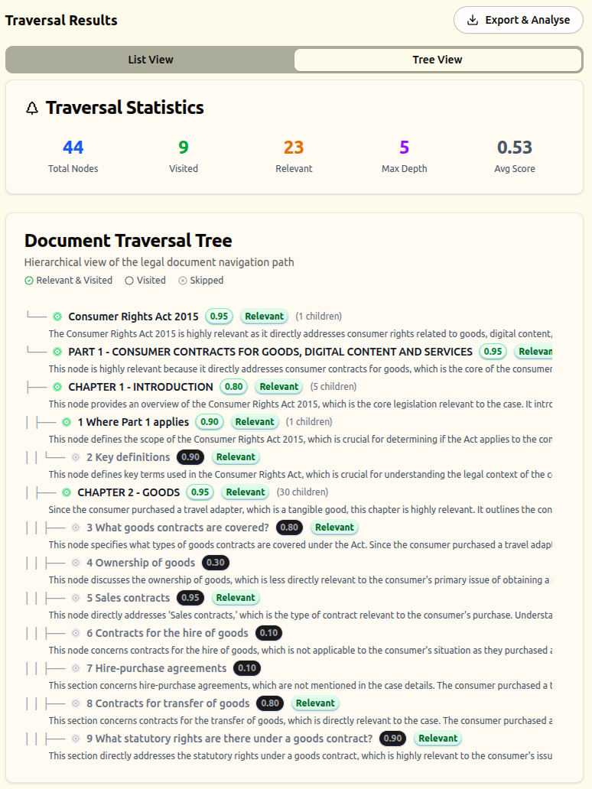
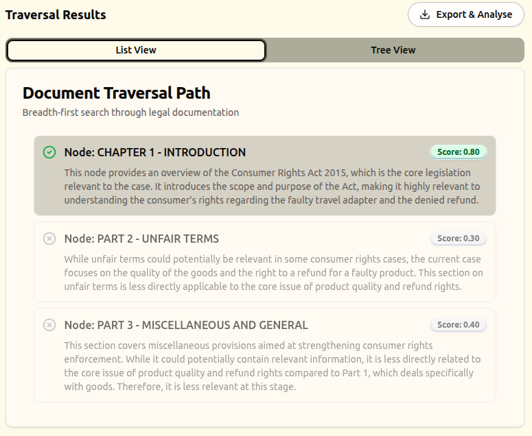
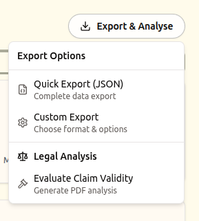

# Know Your Rights

KnowYourRights is an application that seeks to educate ordinary citizens about their rights in consumer protection law.



## Overview

Our product helps UK consumers navigate complex consumer protection legislation by:

- Providing a structured screening process to categorise legal issues
- Offering instant, personalised legal guidance through AI
- Filtering user descriptions to remove bias and personal information
- Delivering clear answers without legal jargon

## Features

### Intelligent Screening System
- Multi-step questionnaire to categorise consumer issues
- Eligibility checking for UK consumer protection laws
- Contract type identification (goods, services, digital content)
- Purchase method tracking (in-person, online, off-premises)

### AI-Powered Content Filtering
- Removes personal identifying information from user descriptions
- Eliminates potentially biased or emotional language
- Preserves core legal facts for accurate processing
- Transparent side-by-side comparison of original vs filtered content

### Conversational Legal Guidance
- Chat interface for follow-up questions after screening
- Context-aware responses based on screening answers
- UK legal compliance focus
- Free and confidential advice

### Decision Tree Creation
- Our proprietary algorithms process legal documentation from various rights laws, extending beyond consumer protection legislation, to generate structured decision tree formats
- These decision trees provide logical interpretability and serve as guidance frameworks for large language model responses

### Advanced Data Management
The application includes sophisticated data processing capabilities as shown in the tree traversal interface, purposed for business-facing diagnostics team.







## Technology Stack

- **Framework**: Next.js 15 with React 19
- **Styling**: Tailwind CSS with custom UI components
- **AI Integration**: Vercel AI SDK with Google Gemini
- **Forms**: React Hook Form with Zod validation
- **Animations**: Framer Motion
- **Package Manager**: Bun (as specified in project configuration)

## Getting Started

### Prerequisites

- Node.js 18+ or Bun
- Google Generative AI API key

### Installation

1. Clone the repository:
```bash
git clone <repository-url>
cd know-your-rights
```

2. Install dependencies:
```bash
bun install
```

3. Set up environment variables:
Create a `.env` file with:
```bash
GOOGLE_GENERATIVE_AI_API_KEY=your_api_key_here
```

4. Run the development server:
```bash
bun run dev
```

5. Open [http://localhost:3000](http://localhost:3000) in your browser.

## Project Structure

```
├── app/
│   ├── (preview)/          # Main application pages
│   └── api/                # API routes for data processing
├── components/
│   ├── screening-chat.tsx  # Main screening interface
│   ├── ui/                 # Reusable UI components
│   └── magicui/           # Custom animated components
├── figs/                   # Documentation figures
│   ├── consumer_facing/    # User interface screenshots
│   └── tree_traversal/     # Data management interfaces
└── lib/                    # Utility functions and schemas
```

## Key Components

### Screening Process
The application guides users through a structured screening process:

1. **Eligibility Check** - Confirms UK consumer protection applicability
2. **Contract Classification** - Identifies the type of purchase/contract
3. **Purchase Method** - Determines how the transaction occurred
4. **Date Collection** - Records when goods/services were received
5. **Issue Description** - Captures the user's problem in their own words

### Content Filtering System
- **Automatic Processing**: AI filters user descriptions to remove bias
- **Privacy Protection**: Strips personal identifying information
- **Transparency**: Shows both original and filtered versions
- **Fallback Mechanisms**: Graceful handling of API failures

## Document hierarchical traversal
- **Human methodology-based**: the document is traversed in a hierarchical zoom out-in manner, mimicking the thought process of a lawyer reading the document.
- **Restricted LLM reliance** Decision made by the LLM agent are strictly grid locked into smaller, compartmentalised decisions.
- **Reproducable and Interpretable**: traversal algorithm enforces reproducable line of thought, which gives interpretable logging of LLM decisions.

## Legal Compliance

This application is prototyped for the UK consumer protection law (but not limited to this use case):

- Focus on Consumer Rights Act 2015
- Distance selling regulations compliance
- Consumer protection from unfair trading regulations
- Goods and services act provisions


**Note**: This application provides general legal guidance and should not replace professional legal advice for complex matters.
